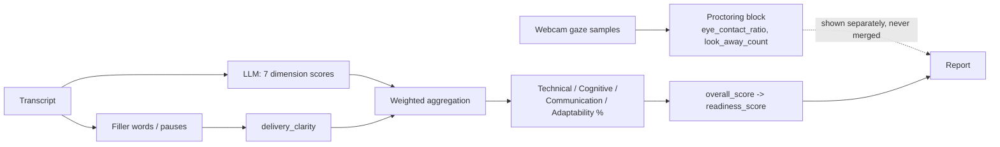
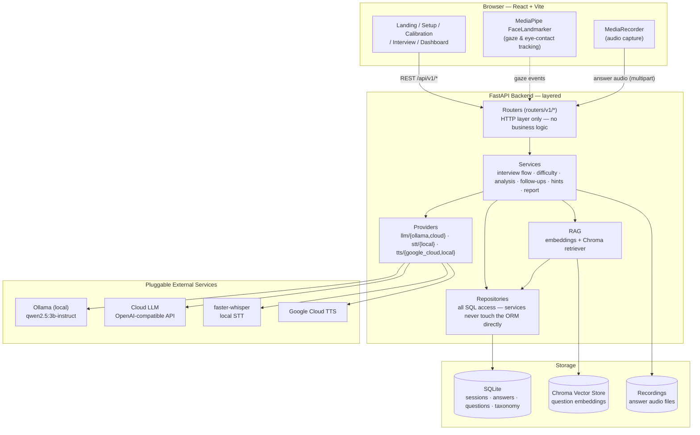
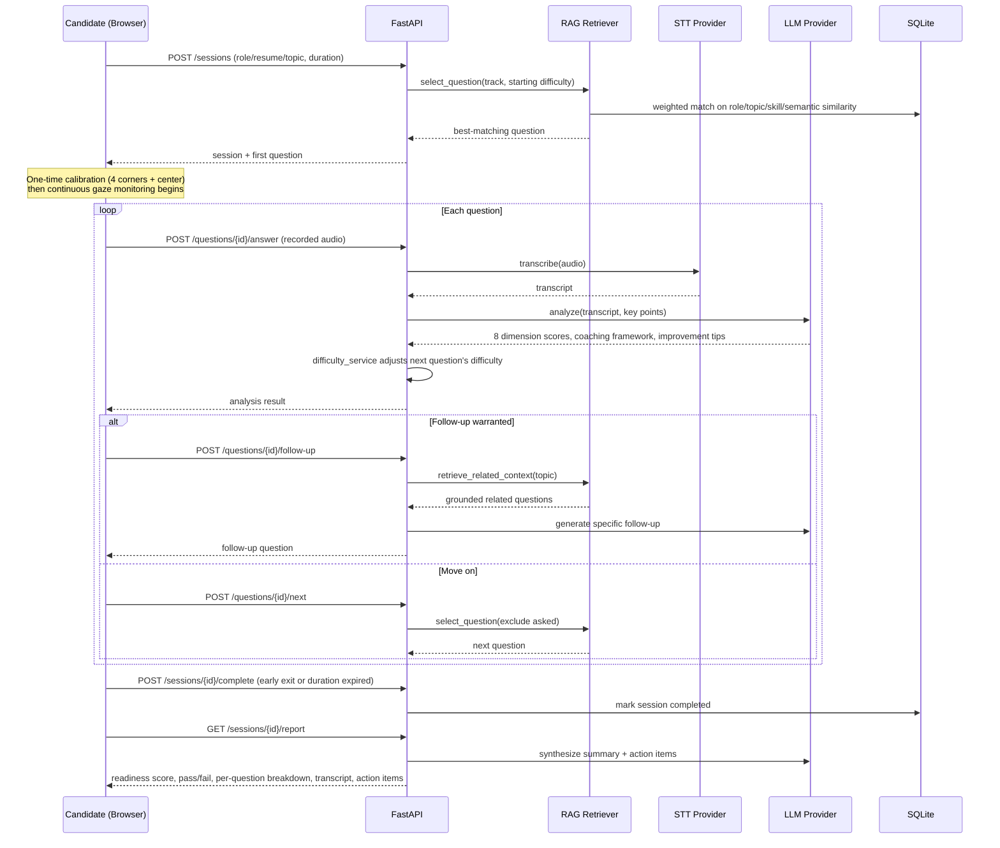
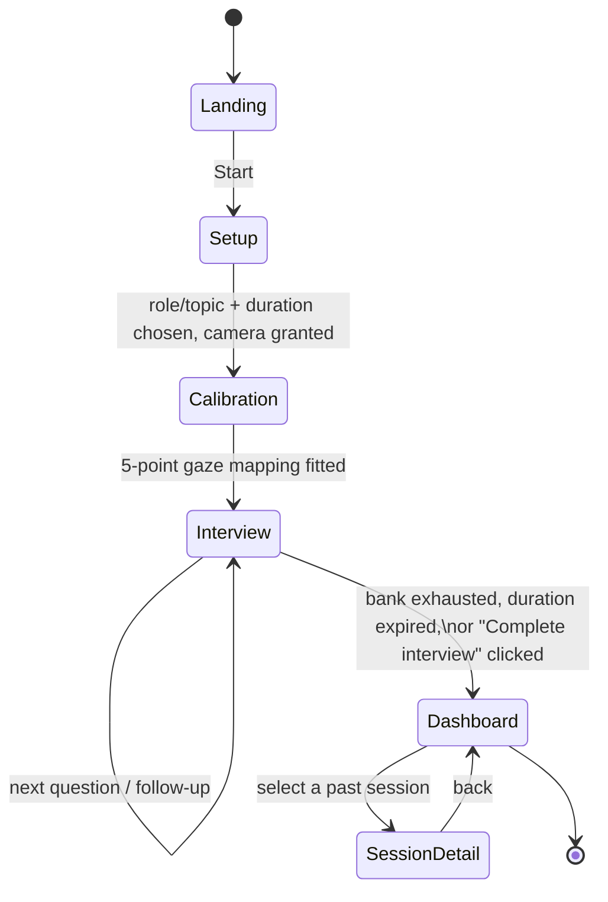

# Cognitive Interview AI

**A voice-driven, AI-powered mock & practice interview platform** that evaluates *how a candidate thinks*, not just whether their final answer is correct — combining cognitive, multi-dimensional LLM grading, live webcam-based eye-contact monitoring kept strictly separate from scoring, adaptive difficulty, speech-to-text/text-to-speech, and a RAG-backed question bank of 900+ interview questions to help candidates build real interview confidence.

<p align="left">
  
  
  
  
  
  
</p>

---

## Table of Contents

- [Overview](#overview)
- [Key Features](#key-features)
- [Cognitive Evaluation](#cognitive-evaluation)
- [Tech Stack](#tech-stack)
- [Architecture](#architecture)
- [Workflow](#workflow)
- [Project Structure](#project-structure)
- [Getting Started](#getting-started)
- [Configuration](#configuration)
- [API Overview](#api-overview)
- [Question Bank](#question-bank)

---

## Overview

Cognitive Interview AI simulates a real technical interview end-to-end:

1. A candidate picks a **role, resume-based, or topic track**, plus an interview **duration** (5 / 10 / 30 min).
2. A one-time **calibration** step maps where the candidate is actually looking on screen.
3. During the interview, the candidate is **continuously monitored** for eye contact via the webcam — if they look away for too long, a gentle on-screen nudge reminds them to look back, without interrupting the flow. This signal is tracked purely as **proctoring data** — it is never mixed into any score.
4. Each answer is **recorded, transcribed, and cognitively graded** by an LLM across 8 weighted dimensions — technical correctness, problem-solving reasoning, depth of understanding, communication, problem approach, adaptability, trade-off analysis, and delivery clarity — not just a single right/wrong check. Difficulty adapts turn-by-turn based on performance, and the system decides whether to ask a grounded follow-up or move to the next question.
5. Only **after** the interview ends does the candidate see their full report: per-question transcripts, cognitive dimension scores, a question-specific coaching breakdown on *how to think through* each question, a readiness rating, and concrete action items.

The whole system is built as **swappable, layered components** — the LLM, speech-to-text, and text-to-speech providers are all configured via environment variables, so it runs entirely offline/local (sized for an 8GB-RAM laptop with an entry-level GPU) or against cloud APIs, with no code changes either way.

## Key Features

- 🎯 **Two modes** — Mock Interview (timed, realistic, no hints) and Practice Mode (hints after 15s of silence)
- 🧭 **Three track types** — Role-based, Resume-based, or Topic-based question selection
- 👁️ **Live gaze & eye-contact monitoring** — client-side MediaPipe FaceLandmarker with a custom 5-point calibration (4 corners + center), least-squares-fitted to the candidate's actual screen
- 📈 **Adaptive difficulty engine** — each answer's score shifts the next question's difficulty up or down
- 🔁 **Smart follow-up logic** — the system decides whether to probe deeper on the same topic or move to a new question, grounded in real related questions from the bank (RAG)
- 🎙️ **Full voice pipeline** — questions are read aloud (TTS), answers are spoken and transcribed (STT)
- 🗂️ **Centralized, many-to-many tagged question bank** — 900+ questions tagged by role, topic, skill, and concept (not siloed per-role banks), each with reference solutions and key points
- 🧠 **Cognitive, multi-dimensional grading** — every answer is scored across 8 weighted dimensions (reasoning, depth, trade-off awareness, adaptability, and more — see [Cognitive Evaluation](#cognitive-evaluation)), judging *how* the candidate reasoned, not only whether the conclusion was right
- 👁️‍🗨️ **Proctoring kept strictly separate from scoring** — eye contact is reported as its own observational block (on-screen %, look-away count) and never affects the readiness score or pass/fail outcome
- 🧭 **Per-question coaching in the report** — for every question, the report explains how a strong answer should have been *approached* (problem understanding → reasoning → trade-offs → adaptability → communication), plus targeted tips for whichever dimensions came out weak
- 📊 **Post-interview report** — readiness score, pass/fail threshold, Technical/Cognitive/Communication/Adaptability breakdown, and LLM-synthesized summary + action items — generated only once the interview actually ends
- ⏱️ **Configurable session length** — 5 / 10 / 30 minute interviews, with a live countdown and a "Complete interview" early-exit option
- 🔌 **Swappable providers** — local (Ollama / faster-whisper / OS voice) or cloud (any OpenAI-compatible LLM, Google Cloud TTS) via a single `.env` change

## Cognitive Evaluation

The core idea behind this project: an interview answer isn't just right or wrong — *how* a
candidate got there matters. Asked "Why did you use MongoDB?", an answer of "because it's
fast" and an answer of "our schemas are flexible and expected to evolve, and I'd prefer
PostgreSQL for relational data" can both reach the same conclusion, but only one demonstrates
real reasoning. This system is built to tell the two apart.

### 8 weighted dimensions

Every answer is scored 0–10 on each dimension below (7 by the LLM, `delivery_clarity`
computed algorithmically from filler words/pauses), then combined into one weighted 0–100
`overall_score`:

| Dimension | Weight | What it judges |
|---|---|---|
| Technical correctness | 30% | Is the core answer factually/technically right? |
| Problem-solving reasoning | 20% | Did they break the problem down and reason step by step, rather than jumping to a conclusion? |
| Depth of understanding | 15% | Do they explain *why/how* from fundamentals, rather than reciting a memorized answer? |
| Communication | 10% | Is the explanation clear and structured, not rambling? |
| Problem approach | 10% | Did they move requirements → approach → validation in a sensible order? |
| Adaptability | 5% | If the interviewer changes a requirement mid-question (e.g. "now assume 100M users"), does the answer adjust? |
| Trade-off analysis | 5% | Do they show awareness of alternatives and pros/cons (SQL vs NoSQL, consistency vs availability), not just defend one option blindly? |
| Delivery clarity | 5% | Hesitation/vagueness in *how* the answer was delivered verbally (fillers, pauses) |

For the report, these 8 dimensions roll up into 4 categories the candidate actually sees —
**Technical**, **Cognitive**, **Communication**, **Adaptability** — each a weighted average of
its member dimensions.

### Proctoring never touches the score

Eye contact is tracked continuously during the interview, but it is reported as its own
**Proctoring** block (`eye_contact_ratio`, `look_away_count`) — informational only. It is never
blended into `overall_score`, `readiness_score`, or the pass/fail decision. A candidate who
gives a technically excellent answer while looking nervous is never marked down for it.



### Per-question coaching, not just a score

For every answered question, the report also generates — specific to that exact question, not
generic advice — a 6-point framework for **how to think through it** (problem understanding,
approach, reasoning, trade-offs, adaptability, communication), and targeted **improvement
tips** for whichever dimensions actually scored weak on that answer. For "How would you design
a URL shortener?", a weak answer gets feedback like:

> **Trade-off analysis:** Discuss the pros and cons of different design choices and how they
> impact the system's performance and scalability.
> **Adaptability:** Consider how the design can be adjusted for different load scenarios and
> future growth.

rather than a flat "7/10, good job."

## Tech Stack

<table>
<tr><td valign="top">

**Frontend**

<br/>
<br/>
<br/>
<br/>
<br/>


</td><td valign="top">

**Backend**

<br/>
<br/>
<br/>
<br/>
<br/>


</td><td valign="top">

**AI / ML**

<br/>
<br/>
<br/>
<br/>
<br/>


</td></tr>
</table>

| Layer | Choice | Why |
|---|---|---|
| LLM (local) | Ollama — `qwen2.5:3b-instruct` | Fits comfortably in 8GB RAM / GTX 1650 (4GB) — no cloud account needed |
| LLM (cloud, optional) | Any OpenAI-compatible `/chat/completions` endpoint | Drop-in swap via `.env` — OpenAI, Groq, Together, OpenRouter, etc. |
| Speech-to-Text | `faster-whisper` (CTranslate2) | Lightweight, fully offline, no `torch` dependency |
| Text-to-Speech | Google Cloud TTS (free tier) → falls back to OS voice | Works with zero setup if no Google credentials are configured |
| Vector store | ChromaDB + FastEmbed (`BAAI/bge-small-en-v1.5`) | CPU-friendly RAG retrieval for question selection & follow-ups |
| Database | SQLite | Zero-setup persistence, right-sized for single-machine/local deployment |

## Architecture

The backend follows a strict **layered architecture** — routers never touch the database directly, services never call a concrete LLM/STT/TTS SDK directly, and every external dependency is swappable behind a `providers/*/factory.py` interface.



**Backend layers** (`backend/app/`):

```
routers/v1/      thin HTTP layer — request/response only, no business logic
services/        interview flow, difficulty adaptation, analysis, follow-ups, hints, reports
rag/             embeddings + Chroma vector store + weighted-ranking retriever
providers/       swappable adapters — llm/{ollama,cloud}, stt/{local}, tts/{google_cloud,local}
repositories/    all SQL access — services never touch the ORM/session directly
models/          SQLAlchemy tables (+ many-to-many taxonomy: Role/Topic/Skill/Concept)
schemas/         Pydantic request/response contracts
core/            settings (env-driven, swappable providers via .env)
```

Because nothing above talks to a concrete provider directly, switching `LLM_PROVIDER=local` → `cloud`, or changing the STT/TTS backend, is a **`.env` change, not a code change**.

## Workflow

### Interview session lifecycle



### Frontend screen flow



The report screen is only reachable **after** a session is explicitly completed — nothing is shown mid-interview beyond the current question and live transcript, by design.

## Project Structure

```
Cognitive Interview AI/
├── backend/
│   ├── app/
│   │   ├── routers/v1/        # HTTP endpoints (sessions, answers, voice, monitoring, admin)
│   │   ├── services/          # interview orchestration, difficulty, analysis, reports
│   │   ├── rag/                # embeddings, Chroma vector store, retriever
│   │   ├── providers/          # llm / stt / tts adapters (swappable)
│   │   ├── repositories/       # SQL access layer
│   │   ├── models/              # SQLAlchemy models + taxonomy (Role/Topic/Skill/Concept)
│   │   ├── schemas/             # Pydantic contracts
│   │   └── core/                 # settings (.env-driven)
│   ├── data/question_bank/     # 900+ questions as versioned JSON files
│   ├── scripts/                 # seed_questions.py, build_index.py, smoke_test.py
│   ├── storage/                  # SQLite DB, Chroma index, recordings (gitignored)
│   └── requirements.txt
├── src/
│   ├── pages/                   # LandingPage, SetupScreen, CalibrationScreen,
│   │                             # InterviewScreen, Dashboard, SessionDetail
│   ├── hooks/                    # useMediaStream, useCalibration, useGazeMonitor, useRecorder
│   ├── components/               # layout, sections (landing page), ui (design system)
│   ├── lib/                       # api.js (backend client), gaze.js (MediaPipe logic)
│   └── data/content.js
├── public/
├── package.json
└── vite.config.js
```

## Getting Started

### Option A: Docker (recommended — nothing to install but Docker)

The only prerequisite is **[Docker Desktop](https://www.docker.com/products/docker-desktop/)**. Python, Node, the question bank, and the search index are all handled inside the containers.

**1. Configure the LLM.** From the project root:

```bash
cp backend/.env.example backend/.env
```

Open `backend/.env` and paste a **[Groq API key](https://console.groq.com)** into `LLM_CLOUD_API_KEY` (free tier is fine). This is what analyses answers — expect ~5 seconds per answer.

**2. Start it:**

```bash
docker compose up --build
```

Then open **http://localhost:5173**. First run takes a few minutes to build the search index over 900+ questions; later starts are quick, since it's cached in a Docker volume.

**Prefer fully offline?** Skip the API key and run:

```bash
docker compose --profile local-llm up --build
```

That adds an Ollama container and pulls a ~2GB model, with no internet needed afterwards. Set `LLM_PROVIDER=local` in `backend/.env`. Be aware answer analysis takes **~90s per answer on CPU** versus ~5s via cloud — fine for a no-internet demo, slow for real practice.

**Stopping:**

```bash
docker compose down        # stop, keep data (DB, index, model) for next time
docker compose down -v     # stop and wipe everything for a clean slate
```

> Speech-to-text and text-to-speech always run locally in both modes — only answer analysis uses the cloud provider.

### Option B: Run natively

### Prerequisites

- **Node.js** v18+ (v20+ recommended)
- **Python** 3.11 (3.10–3.12 also work)
- **[Ollama](https://ollama.com)** — only if running the LLM locally instead of via cloud

### 1. Backend

```bash
cd backend
python -m venv .venv
.venv\Scripts\activate        # Windows — use `source .venv/bin/activate` on macOS/Linux
pip install -r requirements.txt
copy .env.example .env        # Windows — use `cp .env.example .env` on macOS/Linux
```

Add a [Groq API key](https://console.groq.com) to `LLM_CLOUD_API_KEY` in `.env` (the default `LLM_PROVIDER=cloud`). For a fully offline setup instead, set `LLM_PROVIDER=local` and pull the model:

```bash
ollama pull qwen2.5:3b-instruct
```

Seed the question bank and build the search index (one-time; safe to re-run):

```bash
python scripts/migrate_answer_schema.py   # only needed if upgrading an existing DB
python scripts/seed_questions.py
python scripts/build_index.py
```

Run the API:

```bash
uvicorn app.main:app --reload --port 8000
```

Interactive API docs at `http://localhost:8000/docs`.

### 2. Frontend

From the project root, in a separate terminal:

```bash
npm install
npm run dev
```

Open the URL Vite prints (usually `http://localhost:5173`).

Everything runs fully offline/local by default — SQLite for storage, `faster-whisper` for STT, Ollama for the LLM, and an OS-voice TTS fallback if no Google Cloud credentials are set. No API keys are required to boot the app.

## Configuration

All configuration lives in `backend/.env` (copied from `.env.example`). The key switch is `LLM_PROVIDER`:

```bash
# Local (default) — sized for 8GB RAM / entry-level GPU
LLM_PROVIDER=local
LLM_LOCAL_MODEL=qwen2.5:3b-instruct

# Cloud (optional) — any OpenAI-compatible endpoint
LLM_PROVIDER=cloud
LLM_CLOUD_API_KEY=sk-...
LLM_CLOUD_MODEL=gpt-4o-mini
```

Other tunables include `HINT_AFTER_SECONDS`, `AUTO_RECORD_AFTER_SECONDS`, `DIFFICULTY_MIN`/`MAX`, and `READINESS_PASS_THRESHOLD` — see `backend/.env.example` for the full list with comments.

## API Overview

| Endpoint | Purpose |
|---|---|
| `POST /api/v1/sessions` | Start a new interview session (role/resume/topic track, duration) |
| `GET /api/v1/sessions` | List all past sessions |
| `POST /api/v1/questions/{id}/answer` | Submit recorded audio for the current question (multipart) |
| `POST /api/v1/questions/{id}/follow-up` | Request a grounded, RAG-backed follow-up question |
| `POST /api/v1/questions/{id}/next` | Move to the next question, excluding those already asked |
| `POST /api/v1/sessions/{id}/complete` | End a session early (or on duration expiry) |
| `GET /api/v1/sessions/{id}/report` | Full report — readiness score, per-question breakdown, summary, action items |
| `POST /api/v1/monitoring/events` | Client-reported gaze/eye-contact events during the interview |
| `POST /api/v1/admin/questions/bulk-import` | Add new questions to the bank without a server restart |

See `backend/README.md` for the full request/response flow through each layer.

## Question Bank

The question bank is **centralized, not siloed per-role** — every question is tagged through a many-to-many relational schema (`Role` ↔ `Topic` ↔ `Skill` ↔ `Concept`), so adding a new role or technology never requires a new bank, just new tag associations.

- **900+ questions** across DSA, OOP, OS, CN, DBMS, System Design, languages (Java/Python/JS/TypeScript/C++), frontend/backend/DevOps/cloud, ML/statistics, security, testing, distributed systems, and behavioral/leadership.
- Each question carries: type, difficulty (1–5), tagged roles/topics/skills, a reference solution (key points + sample answer), and a follow-up hint.
- Retrieval uses a **weighted ranking function** combining semantic similarity (via Chroma) with role/topic/skill relevance and difficulty fit — with fuzzy tag matching, so entering "backend", "Backend Engineer", or "back-end" all resolve correctly.
- Every answer is graded against the same universal [8-dimension cognitive rubric](#cognitive-evaluation), not a per-question scoring scale — see that section for the full breakdown.
